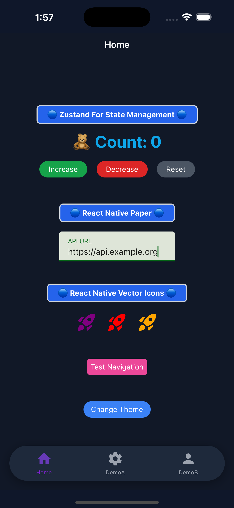
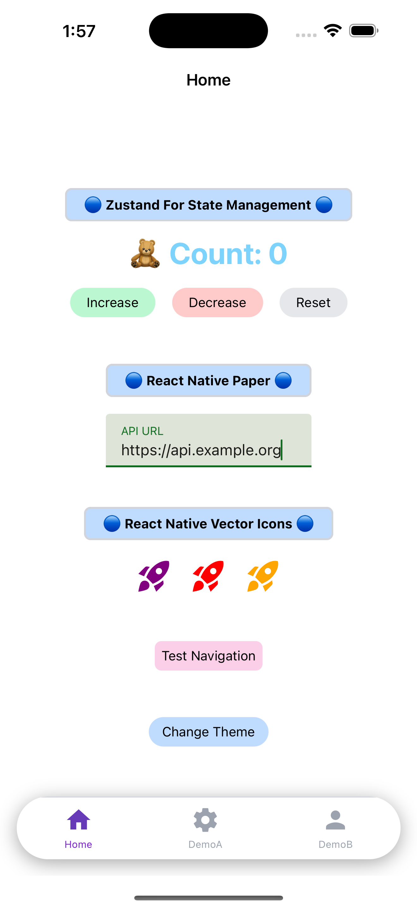

# kickstart-native-cli

A command-line interface (CLI) tool to quickly scaffold React Native projects with a standardized template and essential configurations.

## 📱 Screenshots

<div align="center" style="display: flex; gap: 1rem;">
   
   
</div>

## Features

- Create new React Native projects with TypeScript support
- Set up essential development dependencies
- Configure common project settings
- Initialize Git repository

## Installation

```bash
npx kickstart-native-cli init
```

Example:

```bash
npx kickstart-native init
```

## What's Included

- TypeScript configuration
- ESLint and Prettier setup
- Basic project structure
- Git initialization
- Essential dependencies for React Native development

## Requirements

- Node.js 20 or higher
- npm or yarn
- React Native development environment setup

## Changelog

### v1.2.0 (Latest)

- Improved TypeScript template configuration
- Enhanced error handling for CLI commands
- Added new project structure options
- Fixed dependency versioning issues
- Optimized installation process

### v1.0.0

- Initial release
- Basic project scaffolding
- TypeScript support
- ESLint and Prettier configuration
- Git initialization

## License

MIT
